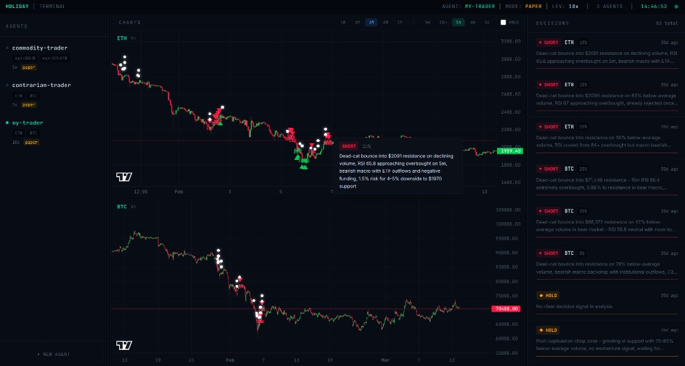

# Holiday

**Go on holiday while your AI trades 24/7.** Autonomous trading agents that never sleep, so you can.

Holiday is a multi-agent trading system that runs on [Hyperliquid](https://hyperliquid.xyz). Each agent has its own persona, risk profile, and trading pairs. A two-stage safety architecture (Decision + Review) ensures no trade executes unless both engines agree.



## Supported Markets

| Category | Assets | Exchange |
|----------|--------|----------|
| **Crypto** | BTC, ETH, SOL | Hyperliquid Perp |
| **Stocks** | AAPL, MSFT, GOOGL, AMZN, META, NVDA, TSLA, NFLX, AMD, ORCL, TSM, INTC, MU, PLTR, COIN, HOOD, MSTR, RIVN, BABA, CRWV, SMSN, HYUNDAI | HIP-3 (xyz) |
| **Commodities** | GOLD, SILVER, PLATINUM, COPPER, WTI OIL, BRENT, NAT GAS | HIP-3 (xyz) |
| **Index / ETF** | NASDAQ (XYZ100), EWY, EWJ, URNM | HIP-3 (xyz) |
| **FX** | USD/JPY, EUR/USD | HIP-3 (xyz) |

All pairs are denominated in USDC.

## Quick Start

### 1. Install Dependencies

```bash
# Backend (from project root)
npm install

# Dashboard
cd dashboard
npm install
```

### 2. Configure Environment

```bash
cp .env.example .env
```

Add your [OpenRouter](https://openrouter.ai) API key to `.env`:

```
OPENROUTER_API_KEY=your_key_here
```

### 3. Run the Dashboard

```bash
cd dashboard
npm run dev
```

This starts both the API server (`localhost:3001`) and the Vite dev server (`localhost:5173`).

## Commands

### Running Agents

```bash
# Run an agent (with built-in research)
node index.js --agent my-trader

# Run without research (when using the research daemon)
node index.js --agent my-trader --no-research

# Single iteration (test run, exits after one cycle)
node index.js --agent my-trader --once

# Validate config only
node index.js --agent my-trader --validate
```

### Research

Research reports are saved to `memory/research/` and shared across all agents.

```bash
# One-off research run
npm run research
node scripts/run-research.js --agent my-trader
node scripts/run-research.js "Bitcoin technical analysis"

# Continuous research daemon (shared by all agents)
node scripts/research-daemon.js                     # Every 12h (default)
node scripts/research-daemon.js --interval 6        # Every 6h
node scripts/research-daemon.js --once              # Single run
node scripts/research-daemon.js --query "Gold macro" # Custom query
```

### Backtesting

Replay the full Decision + Review pipeline against historical data.

```bash
# Step 1: Backfill research for the date range
node scripts/backfill-research.js --from 2026-01-30 --to 2026-02-06

# Step 2: Run the backtest
node scripts/backtest.js --agent contrarian-trader --from 2026-01-30 --to 2026-02-06
```

Backtest results (PnL, trades, equity curve) are saved to `memory/backtests/` and viewable in the dashboard under the **Backtests** tab.

### Running Multiple Agents

Run the research daemon once, then start each agent with `--no-research` to avoid duplicate reports:

```bash
# Terminal 1: Shared research
node scripts/research-daemon.js --interval 6

# Terminal 2
node index.js --agent my-trader --no-research

# Terminal 3
node index.js --agent contrarian-trader --no-research

# Terminal 4
node index.js --agent commodity-trader --no-research
```

### Creating Agents

Via the dashboard UI (click **+ New Agent**), or via CLI:

```bash
node scripts/create-agent.js
```

Agent configs are stored in `config/agents/<name>.json`.

### Dashboard

```bash
cd dashboard
npm run dev       # Dev mode (API + Vite with HMR)
npm run build     # Build for production
npm start         # Production server only
```

The dashboard includes a presentation demo at [`/demo`](http://localhost:5173/demo) — a 12-slide interactive walkthrough of the system's architecture, safety mechanisms, and backtest results.

## Architecture

```
Holiday/
├── index.js                  # Entry point, CLI arg parsing
├── agent-loop.js             # Ralph Loop: fresh context each iteration
├── engines/
│   ├── research.js           # Perplexity sonar-deep-research via OpenRouter
│   ├── decision.js           # Proposes trades (analyzes charts + research + history)
│   └── review.js             # Safety layer: validates & executes via tool calls
├── exchanges/
│   └── hyperliquid.js        # Hyperliquid client (perp, spot, HIP-3)
├── scripts/
│   ├── backtest.js           # Historical backtesting engine
│   ├── backfill-research.js  # Backfill research for a date range
│   ├── research-daemon.js    # Standalone continuous research process
│   ├── run-research.js       # One-off research runner
│   ├── create-agent.js       # CLI agent creator
│   └── validate-config.js    # Config validator
├── config/agents/            # Agent configuration files
├── memory/
│   ├── decisions/            # All agent decisions (markdown)
│   ├── research/             # Shared research reports (markdown)
│   └── backtests/            # Backtest results and decision logs
├── dashboard/
│   ├── server.js             # Express API (agents, candles, decisions, research)
│   └── src/                  # React + Vite frontend (+ /demo presentation)
└── .env                      # OpenRouter API key
```

### Two-Stage Safety

1. **Decision Engine** -- Analyzes macro research, price charts, and decision history. Proposes a trade (LONG / SHORT / HOLD).
2. **Review Engine** -- A separate model validates the proposal against persona rules, risk limits, and allowed symbols. Executes via tool calls or rejects to HOLD.

No trade executes unless both engines agree.

### Ralph Loop Pattern

Each iteration starts with fresh context. No state is carried in memory between loops -- only what's persisted to markdown files:

- **Research reports** in `memory/research/`
- **Decision history** in `memory/decisions/`
- **Rolling summaries** in `memory/<agent>-summary.md`

This prevents context drift and enables compound learning through decision history.

## Agent Configuration

Copy the example and fill in your wallet details:

```bash
cp config/agents/my-trader.example.json config/agents/my-trader.json
```

Example config (`config/agents/my-trader.example.json`):

```json
{
  "agentId": "my-trader",
  "loopInterval": 3600000,
  "persona": "You are a momentum trader...",
  "walletAddress": "0x...",
  "privateKey": "0x...",
  "tradingPairs": [
    { "symbol": "ETH", "market": "perp" },
    { "symbol": "BTC", "market": "perp" }
  ],
  "researchInterval": 43200000,
  "maxPositionSize": 0.5,
  "leverage": 10,
  "executionMode": "paper",
  "models": {
    "research": "perplexity/sonar-deep-research",
    "decision": "moonshotai/kimi-k2.5",
    "review": "moonshotai/kimi-k2.5"
  }
}
```

| Field | Description |
|-------|-------------|
| `loopInterval` | Milliseconds between decision cycles (3600000 = 1h) |
| `persona` | Trading personality that guides decisions |
| `tradingPairs` | Array of `{ symbol, market }` -- market is `perp` or `hip3` |
| `maxPositionSize` | Max allocation per trade as decimal (0.5 = 50%) |
| `leverage` | Position leverage multiplier |
| `executionMode` | `paper` (simulated) or `live` (real orders) |
| `researchInterval` | Milliseconds between research runs (43200000 = 12h) |

### HIP-3 Symbols

For stocks, commodities, FX, and indices on Hyperliquid's xyz exchange, use the `xyz:` prefix:

```json
{ "symbol": "xyz:GOLD", "market": "hip3" }
{ "symbol": "xyz:TSLA", "market": "hip3" }
{ "symbol": "xyz:JPY", "market": "hip3" }
```

## License

MIT
